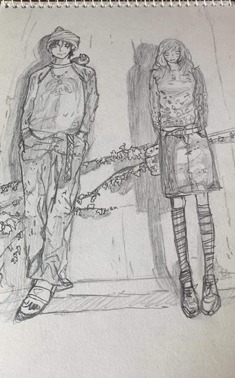

  Ever since I was young, I’ve loved drawing so much that I once dreamed of becoming an artist.  
  Although I don’t draw as often these days, during elementary, middle, and high school I would always draw whenever I had free time.  
  When I draw, hours pass by in the blink of an eye — I can fully concentrate on it without any distractions. 
  However, I eventually gave up on the dream of becoming an artist, realizing there were many people who were far more talented than me.

  

  

    
  

  
  

    <h2 style="font-size: 1.2rem; color: #003366; margin-bottom: 12px;">🎨 Guiyeoni / *He Was Cool*</h2>
    

      Drawing is not just a simple hobby for me — it’s a way to express my emotions.  
      The greatest charm of drawing is the ability to lose track of time and completely immerse myself in the process.
    

  

