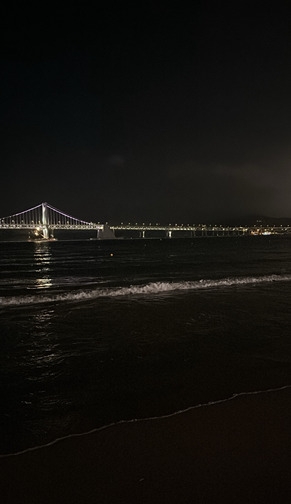
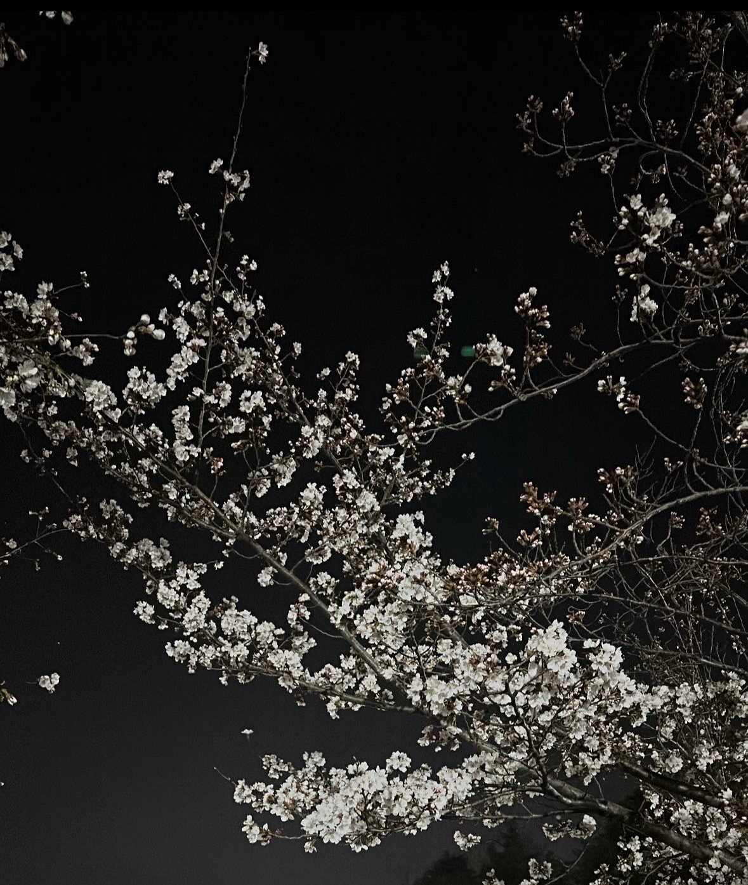

  Photography is more than just a hobby for me — it’s a way to express and record emotions in everyday life.  
  I especially enjoy capturing warm and emotional images that blend the atmosphere of nature and the city.  
  Among all subjects, I’m particularly drawn to photographing the ocean. Since I’m from Busan, I often get to see the sea,  
  and the night view of Gwangalli Beach is truly stunning.  
  Through my photos, I try to evoke the same emotions in others that I feel when I take them.

  

<!-- ✅ Card 1 -->

  
  

    
   

      
    

   

      <h3 style="margin-top: 0; font-size: 1.3rem; color: #003366;">▲ Gwangalli Beach</h3>
      

        A nighttime landscape of Gwangalli Beach. 
        The lights of the Gwangandaegyo Bridge contrast beautifully against the dark background, creating a breathtaking view.  
        I highly recommend visiting Gwangalli at night.
      

    

  

<!-- ✅ Card 2 -->

  
  

    
   

      
    

   

      <h3 style="margin-top: 0; font-size: 1.3rem; color: #003366;">▲ Full Moon</h3>
      

        This full moon photo was taken near the Creative Hall on campus in 2023. 
        It was so beautiful that I couldn’t help but take a picture.  
        It’s hard to believe that two years have already passed since that night.
      

    

  

<!-- ✅ Card 3 -->

  
  

    
   

      
    

   

      <h3 style="margin-top: 0; font-size: 1.3rem; color: #003366;">▲ Cherry Blossoms</h3>
      

        I took this cherry blossom photo in March 2023 while walking back to my dorm after studying at the library. 
        During springtime, the cherry blossoms at Jeonbuk National University bloom beautifully, creating an unforgettable scene.
      

    

  

<!-- ✅ Hover effect -->

