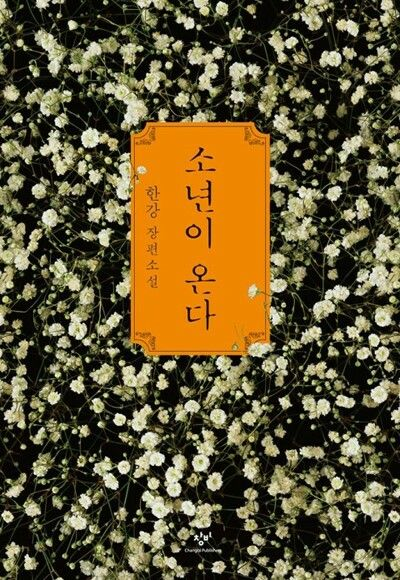
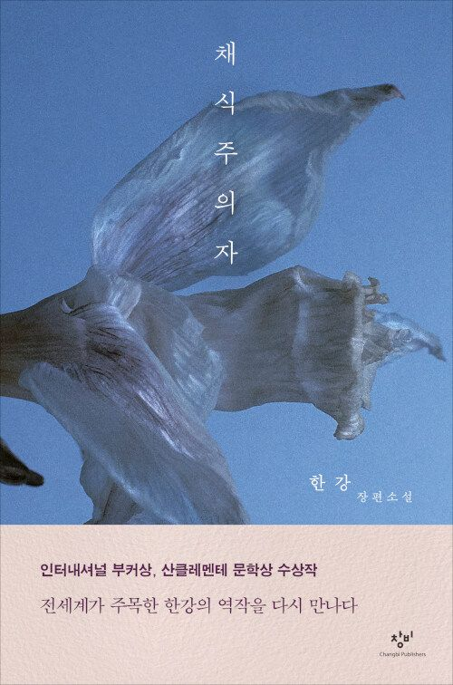

  I didn’t enjoy reading much when I was younger, but as time went by, I came to realize the importance of reading and gradually developed the habit of picking up books.  
  At first, even reading for ten minutes felt difficult, but over time, I became accustomed to it — ten minutes turned into thirty, and eventually an hour or more. 
  Reading allows me to clear my mind, immerse myself in the story, and visualize what I’m reading in my head.  
  It also feels rewarding to learn things I didn’t know before. Through books, I’ve been able to broaden my perspective on the world and cultivate deeper thinking.  
  I especially enjoy reading works on the humanities, as they help me better understand people and society.

  

<!-- ✅ Card 1 -->

  

    
   

      
    

   

      <h3 style="margin-top: 0; font-size: 1.3rem; color: #003366; text-align: left;">
        ▲ *No Longer Human* / Osamu Dazai
      </h3>
      

                   <strong>Summary</strong> 
            The protagonist, “Yozo,” has always struggled to fit in with others, pretending to smile and act cheerful to hide his anxiety and emptiness.  
            He performs clownishly to mask his unease, yet gradually falls into despair, believing he is no longer human.  
            As an adult, his life spirals downward into alcohol, women, and suicide attempts.  
            Surrounded by betrayal and social stigma, he becomes completely isolated.  
            In the end, Yozo accepts himself as a being unqualified to live as a human — leading to his tragic downfall.
      

    

  

<!-- ✅ Card 2 -->

  

    
   

      
    

   

      <h3 style="margin-top: 0; font-size: 1.3rem; color: #003366; text-align: left;">
        ▲ *The Boy Is Coming* / Han Kang
      </h3>
      

                   <strong>Summary</strong> 
            Set during the 1980 Gwangju Uprising, a fifteen-year-old boy named Dong-ho enters a civilian shelter to find his friend’s body.  
            There, he witnesses the brutal scenes of death and violence, becoming entangled in the tragedy of Gwangju.  
            The novel then shifts to the perspectives of those who remember him, showing how that day’s trauma shaped their lives.  
            Under the weight of state violence, guilt, and silence, *The Boy Is Coming* questions humanity and the meaning of remembrance through the story of one boy’s death.
      

    

  

<!-- ✅ Card 3 -->

  

    
   

      
    

   

      <h3 style="margin-top: 0; font-size: 1.3rem; color: #003366; text-align: left;">
        ▲ *The Vegetarian* / Han Kang
      </h3>
      

                   <strong>Summary</strong> 
            The protagonist, Yeong-hye, once an ordinary woman, suddenly refuses to eat meat after recurring nightmares.  
            Her family cannot understand her decision and violently tries to suppress her.  
            Abandoned by her husband and family, Yeong-hye becomes increasingly detached from reality.  
            Her behavior represents a desperate attempt to become a pure, nonviolent being — like a plant.  
            The novel explores human desire, violence, and the oppression of individuality, questioning the nature of humanity and the freedom of the mind.
      

    

  

<!-- ✅ Hover effect -->

