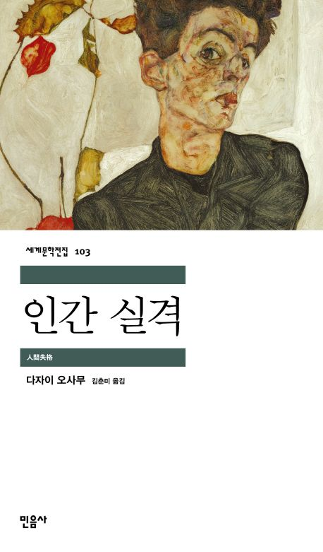

When I was young, I didn’t particularly enjoy reading books.  
However, as time went by, I came to realize the importance of reading and started building the habit of reading regularly.  
At first, even reading for ten minutes felt difficult, but as I got used to it, it gradually increased to thirty minutes and even an hour.  
Through reading, I was able to clear my mind of distractions and imagine the scenes vividly in my head.  
I also enjoyed the feeling of learning things I didn’t know before.  
Reading has allowed me to broaden my perspective on the world and develop deeper thinking skills.  
In particular, I enjoy reading humanities books to deepen my understanding of people and society.

  <!-- 독서 카드 -->
  

    
   

      
    

   

      <h3 style="margin-top: 0; font-size: 1.3rem; color: #003366; text-align: left;">
        ▲ No Longer Human / Osamu Dazai
      </h3>
      

                   Plot Summary 
            The protagonist, Yozo, has been unable to fit in with others since childhood and lives by pretending to smile.  
            To hide his inner anxiety and emptiness, he acts humorously, but gradually falls into despair, believing he is "no longer human."  
            As an adult, his life collapses due to alcohol, women, and repeated suicide attempts.  
            Surrounded by betrayal and social stigma, he becomes completely isolated.  
            In the end, Yozo accepts himself as someone who has lost the “qualification to be human,” and his life ends in ruin.
      

    

  

  <!-- 독서 카드 -->
  

    
   

      
    

   

      <h3 style="margin-top: 0; font-size: 1.3rem; color: #003366; text-align: left;">
        ▲ Human Acts / Han Kang
      </h3>
      

                   Plot Summary 
            During the Gwangju Uprising in May 1980, a fifteen-year-old boy named Dong-ho enters a civilian militia center to find his friend’s body.  
            He witnesses death and violence firsthand, experiencing the horror of Gwangju.  
            The story then unfolds through the perspectives of those who remember Dong-ho, revealing how that tragic day left lasting scars on their lives.  
            The novel intertwines the guilt of the survivors and the loss of humanity under state violence.  
            Ultimately, *Human Acts* questions the meaning of human dignity and memory through the death of a young boy.
      

    

  

  <!-- 독서 카드 -->
  

    
   

      
    

   

      <h3 style="margin-top: 0; font-size: 1.3rem; color: #003366; text-align: left;">
        ▲ The Vegetarian / Han Kang
      </h3>
      

                   Plot Summary 
            Yeong-hye, an ordinary woman, suddenly refuses to eat meat after a series of disturbing nightmares.  
            Her family cannot understand her change and responds with violence and repression.  
            Abandoned by her husband and family, Yeong-hye gradually becomes disconnected from reality.  
            Her transformation represents a desperate struggle to become a pure, non-violent being like a plant.  
            The novel explores human desire, violence, and the oppression of society, questioning the essence of human nature and the freedom of the mind.
      

    

  

<!-- hover 효과 -->

