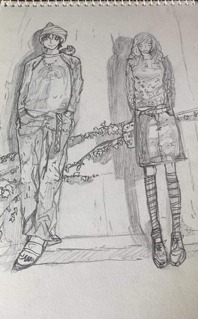

  저는 어렸을 때부터 꿈이 화가였을 정도로 그림 그리는 것을 좋아했습니다. 
  최근에는 그림을 잘 그리지는 않지만 초등학교, 중학교, 고등학교 때는 틈틈이 시간이 나면 항상 그림을 그렸습니다. 
  그림을 그리다 보면 몇 시간씩 훌쩍 지나가 버려, 잡생각 없이 온전히 그림에 집중할 수 있어서 좋았습니다. 
  하지만 저보다 그림을 잘 그리는 사람이 많기에 꿈을 포기할 수밖에 없었습니다.

  

  

    
  

  
  

    <h2 style="font-size: 1.2rem; color: #003366; margin-bottom: 12px;">🎨 귀여니 / 그놈은 멋있었다</h2>
    

      그림을 그리는 것은 제게 단순한 취미가 아니라, 감정을 표현하는 방법입니다. 시간을 잊고 몰입할 수 있다는 점이 가장 큰 매력입니다.
    

  

