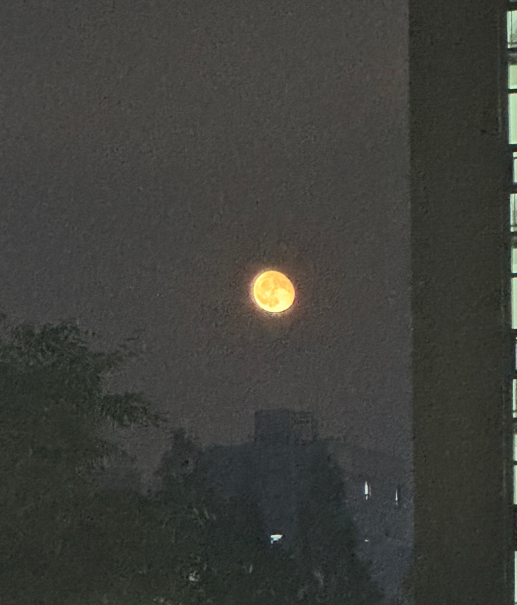
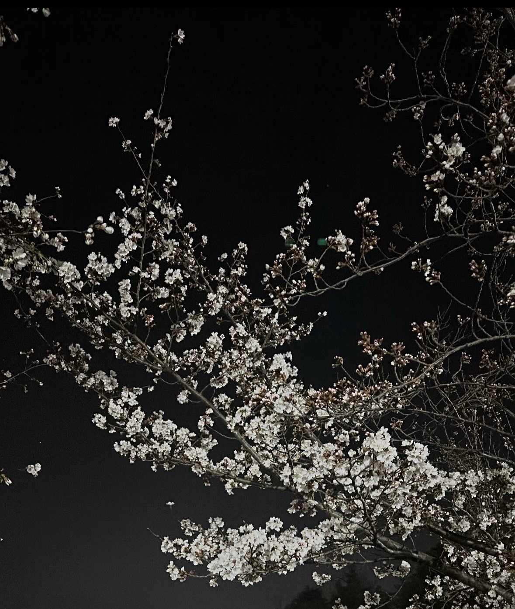

사진 촬영은 제게 단순한 취미를 넘어 일상의 감정을 기록하는 하나의 표현 방식입니다.
특히 자연과 도시의 분위기를 활용해 따뜻하면서도 감성적인 이미지를 담는 것을 좋아합니다.  
자연중에서도 특히 바다사진을 찍는 것을 좋아합니다. 제 본가가 부산이라 많은 바다를 볼 수 있는데 
광안리의 야간 바다 배경이 정말 이쁩니다.
이러한 사진을 통해서 보는 이로 하여금 같은 감정을 느낄 수 있도록 표현합니다.

  <!-- 사진 카드 -->
  

    
    
   

      
    

    
   

      <h3 style="margin-top: 0; font-size: 1.3rem; color: #003366; text-align: left;">
        ▲ 광안리
      </h3>
      

                광안리의 야간풍경 사진입니다.
                광안리의 야간에는 광안대교의 불빛이 켜지며 어두운 배경과 대비되어 더욱 더 이쁘게 보입니다. 광안리는 밤에 가는거 추천합니다.
      

    

  

  <!-- 사진 카드 -->
  

    
    
   

      
    

    
   

      <h3 style="margin-top: 0; font-size: 1.3rem; color: #003366; text-align: left;">
        ▲ 달
      </h3>
      

                2023년도에 학교 창의관쪽에서 찍은 보름달입니다. 너무 예뻐서 사진하나 찍었습니다. 벌써 2년전이라는게 안믿깁니다.    
      

    

  

  

    
    
   

      
    

    
   

      <h3 style="margin-top: 0; font-size: 1.3rem; color: #003366; text-align: left;">
        ▲ 벚꽃
      </h3>
      

                2023년도에 도서관에서 공부하고 기숙사 가는길에 찍은 벚꽃사진입니다. 이때가 3월달이였는데 전북대학교는 벚꽃이 참 이쁘게 피는 것 같습니다.    
      

    

  

<!-- hover 효과 -->

