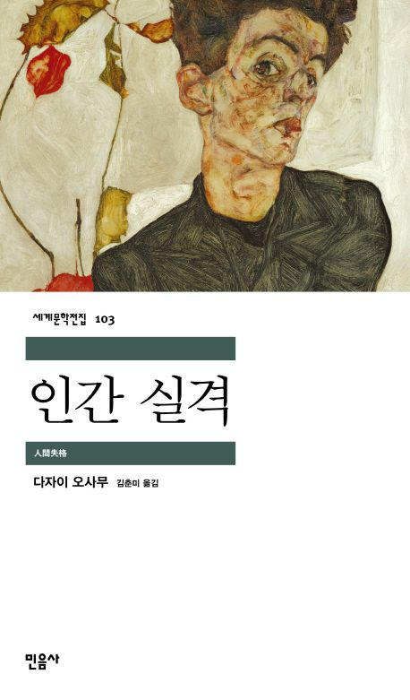
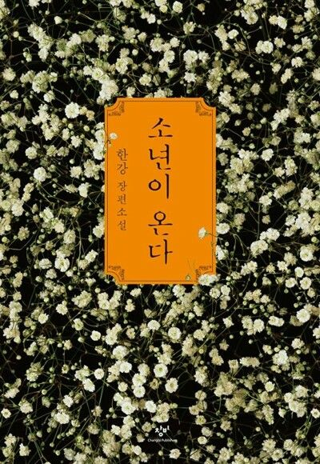
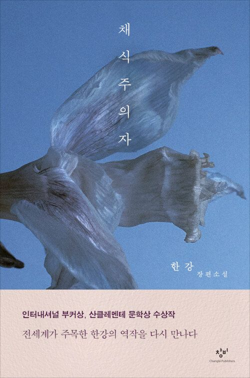

저는 어렸을때는 책 읽는 것을 좋아하지는 않았지만 점차 시간이 지나면서 독서의 중요성을 깨닫고 책 읽는 습관을 들이기 시작하였습니다.
처음에는 십분 읽는 것도 매우 힘들었지만 점차 익숙해지고 시간이 지나다보니 삼십분, 한시간 점점 늘게 되었습니다. 
독서를 하면서 잡생각을 지우고 그 책의 내용을 머릿속으로 상상하며 그려지는 것이 좋았습니다.
또한 책을 통해 모르던 것을 알게되는 기분이 좋았습니다. 책을 통해 세상을 바라보는 관점을 확장하고, 깊이 있는 사고력을 기를수 있었습니다.
특히 인문학 서적을 좋아해 사람과 사회에 대한 이해를 넓히려 노력합니다.

  

  <!-- 독서 카드 -->
  

    
   

      
    

   

      <h3 style="margin-top: 0; font-size: 1.3rem; color: #003366; text-align: left;">
        ▲ 인간실격 / 다자이 오사무
      </h3>
      

                   줄거리 요약 
            주인공 ‘요조’는 어릴 때부터 사람들과 어울리지 못하고, 겉으로는 웃음을 가장하며 살아간다. 
            내면의 불안과 허무를 숨기기 위해 익살스럽게 행동하지만, 점점 자신이 ‘인간답지 않다’는 절망에 빠진다. 
            성인이 된 뒤에도 술과 여자, 자살 시도 등으로 삶이 무너져 내린다. 
            주변 사람들의 배신과 사회적 낙인 속에서 완전히 고립된다. 
            결국 요조는 ‘인간으로서의 자격을 상실한 존재’로 자신을 인정하며 파멸로 끝난다.
      

    

  

  <!-- 독서 카드 -->
  

    
   

      
    

   

      <h3 style="margin-top: 0; font-size: 1.3rem; color: #003366; text-align: left;">
        ▲ 소년이 온다 / 한강
      </h3>
      

                   줄거리 요약 
            1980년 5·18 광주민주화운동 당시, 열다섯 살 소년 ‘동호’가 친구의 시신을 찾으러 시민군 수습소에 들어간다.
            그는 죽음과 폭력의 현장을 목격하며, 점점 광주의 참상을 몸으로 겪게 된다.
            이후 작품은 동호를 기억하는 주변 인물들의 시점으로 이어지며, 그날의 상처가 각자의 삶에 남긴 흔적을 보여준다.
            국가 폭력 아래 짓밟힌 인간성과 침묵 속에서도 살아남은 자들의 죄책감이 교차한다.
            결국 『소년이 온다』는 한 소년의 죽음을 통해 인간의 존엄과 기억의 의미를 묻는 작품이다.
      

    

  

  <!-- 독서 카드 -->
  

    
   

      
    

   

      <h3 style="margin-top: 0; font-size: 1.3rem; color: #003366; text-align: left;">
        ▲ 채식주의자 / 한강
      </h3>
      

                   줄거리 요약 
            평범했던 주인공 ‘영혜’는 어느 날 반복되는 악몽을 계기로 고기를 거부하며 채식주의자가 된다.
            가족들은 그녀의 변화를 이해하지 못하고 폭력적으로 억압한다.
            남편과 가족에게 버림받은 영혜는 점점 현실과 단절되어 간다.
            그녀의 행동은 식물처럼 순수하고 폭력 없는 존재가 되고자 하는 몸부림으로 나타난다.
            작품은 개인의 욕망, 폭력, 그리고 사회의 억압 속에서 ‘인간의 본성’과 ‘정신의 자유’를 질문한다.
      

    

  

<!-- hover 효과 -->

